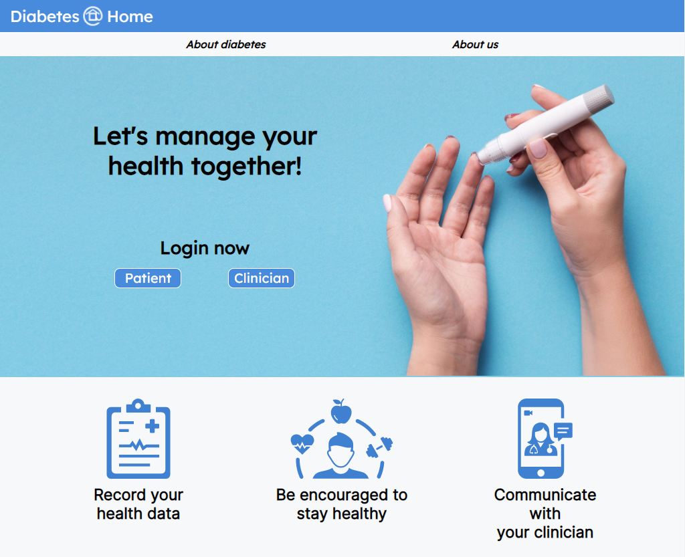

# Diabetes@Home

'Diabetes @ Home' is the flagship app from tech-newcomers 'Group xD'.
The app endeavours to simplify and habituate the oftentimes tedious task of keeping track of one's own health data, while also offering client-patient communication features for people with Diabetes. The app allows users to make daily logs of some of the most important health data attributes for diabetes patients (Blood-Glucose Levels, Insulin, Weight, and step-count) and to easily keep track of changes to these health indicators over time. Clinicians, through their own dedicated user-interface can easily glance at (or deeply analyse) this same data for a number of their patients, and critically, provide timely advise and messages of encouragement to help their patients alomng their diabetes journey's.  

App deployed on Heroku: https://diabetes-at-home-xd.herokuapp.com/

## Features

### Clinician
- Clinicians can access all of their **patients' profiles** from the clinician dashboard by clicking on the patient's name in the table. 
- From the patient profile, clinicians can view the **patient's details** and all entries that the patient has made. 
- The table of **historical data** can be toggled between chart and table view via the "Show Chart/Table" button on the top right of the table/charts. 
- There are **three views** for this page which are toggled by the three buttons in the top right of the page. These views from left to right are the time-series requirements (what data the patient needs to submit, safety thresholds), support messages (messages the clinician has already sent and the ability to send new messages to the patient), and clinician notes (notes about the patient that can only be seen by the clinician). 
- The table in the individual patient view is **clickable** so that the clinician can view a corresponding **comment** for the entry. 
- Clinicians can also view **all comments** made by patients through the "Comments" tab in the navigation bar. These comments can be filtered by patient and date. 
- Clinicians can also **add new patients** via the "Add Patient" tab in the navigation bar.

### Patient
Once logged in, patients can view most of their information from the dashboard. 
- The **logo** in the navigation bar's left leads all users to the hero page but keeps users logged in. 
- On the right of the navigation bar, the **"About" tab** reveals a dropdown to access both of the about pages. 
- In the dashboard, the top row shows the **patient's information** such as name, age, gender and engagement rate. 
- This is followed by the **leaderboard** which is scrollable to view the top 5 users. The top of the leaderboard shows the patient's engagement rate and how far behind they are from the patient ranked above them. 
- The last feature in the top row displays all the **messages** the patient has been sent by their clinician. This feature also flags for the user if there is a new message with a "NEW!" marker. 
- The second row of the patient's dashboard displays the **recent history** so that this data is easy to read. It is broken down into "Today's Data", "7-Day Averages" and a 7-Day chart. 
- The last section is a **table** of all the patients data that has been entered but this can be toggled into **charts** of all the data types through the button on the top right of the table. The charts can also be toggled back to table view via the same button. 
- The user can enter data for today via the **new entry** button in the bottom right of the page which creates a pop up. When entering new data, the patient does not have to enter all the data at once and can change any of the values already entered for the same day.

### Shared
- The **settings page** can be accessed by both patients and clinicians via the rightmost button in the navigation bar. This settings page allow users to change their passwords as well as the colour theme of their pages. Patients are also able to change their nickname on the settings page.

## Tech Stack

The web application, coded primarily in Node.js and the usual front-end web-based languages of HTML and CSS, utilises the asynchronous and event-driven architecture of Node to connect the front end to a host of back-end frameworks and server side tools including:

- Express: The underlying framework and module library (through NPM: Node Package Manager) for Node, express provides utility in writing path routes, ports, managing middleware and is the basis for the integration of templating engines.
- Handlebars: The templating language used for the creation and overlapping of views (including partial views).
- Mongoose: The library that connects the Express framework and MongoDB database.
- MongoDB Atlas: The cloud-based database of choice for handling data and requests to data.
- Heroku: The app is deployed on the cloud platform Heroku.
- Passport: The middleware that provides tools for Express in order to implement authentication of mainly usernames and passwords.
- Bcrypt: The passwords are hashed before being stored in the database to safely.

## Contributors

- Hannah Redwood-Segovia, Student ID - 1172839
- Vivien Guo, Student ID - 1173459
- Flynn Schneider, Student ID - 982143
- Bruce Zhu, Student ID - 1100017
- Xuanhao Zhang, Student ID - 1133384
